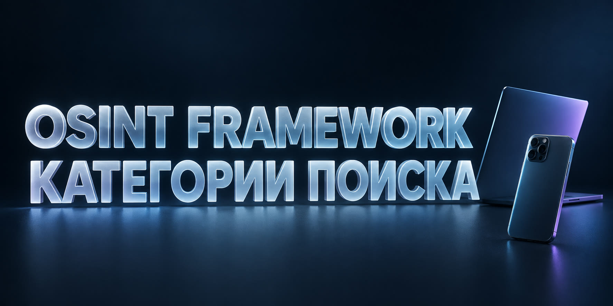

# OSINT Framework: категории поиска

**OSINT Framework** — это карта категорий поиска. Она помогает быстро понять, какой инструмент нужен для телефона, email, username, фотографии, домена или профиля. Вместо случайного открытия десятков сайтов можно выбрать нужную ветку и двигаться от исходных данных к связанным результатам.

**[Открыть поиск: OSINT Framework: категории поиска](https://probivtg.pro/?utm_source=github&utm_medium=organic&utm_campaign=osint-poisk-bot&utm_content=osint-framework&utm_term=top&ref=github_osint-poisk-bot_osint-framework_top)**

## Как читать OSINT Framework

В центре находится тип исходных данных. Дальше идут группы инструментов: поиск аккаунтов, проверка контактов, изображения, домены, архивы, карты и открытые документы. Каждая группа отвечает на свой вопрос. Если известен username, нет смысла начинать с инструментов для IP или файлов; сначала нужны поиск по никам, социальные сети и Telegram.

### Телефон

Эта ветка ведёт к объявлениям, профилям, отзывам, карточкам компаний и публичным контактам. Найденный email или username затем становится новым запросом.

### Email

Здесь полезны поиск точного адреса, часть до `@`, домен после `@`, страницы организаций и открытые регистрации. Рабочий адрес часто соединяет человека с проектом или сайтом.

### Username и Telegram

Категория подходит для одинаковых ников на разных площадках, старых вариантов имени, Telegram username и числового ID. Сравнивают аватары, описание, город, внешние ссылки и даты.

### Фотографии

Поиск похожих изображений помогает найти копии снимка, страницы с тем же аватаром и более ранние публикации. После этого в работу идут имена, ники и подписи рядом с фотографией.

**[Продолжить поиск в Telegram-боте](https://probivtg.pro/?utm_source=github&utm_medium=organic&utm_campaign=osint-poisk-bot&utm_content=osint-framework&utm_term=middle&ref=github_osint-poisk-bot_osint-framework_middle)**

## Схема одного исследования

Допустим, известен Telegram username. Сначала открывается ветка поиска по никам. Она даёт несколько страниц и старый аватар. Затем фотография проверяется отдельно, а найденный email переводит поиск в категорию контактов и доменов. В конце остаётся не набор несвязанных ссылок, а маршрут: username → профиль → фото → email → сайт.

Framework удобен именно переходами. Один инструмент редко отвечает на всё, зато правильно выбранная последовательность быстро расширяет исходный набор данных.

## Как выбрать полезный инструмент

- он принимает тот тип данных, который уже известен;
- показывает источник или прямую ссылку на результат;
- не заставляет вручную повторять один запрос десятки раз;
- позволяет продолжить поиск по найденному признаку;
- выдаёт понятный результат без лишней технической информации.

Если сервис даёт только общий список, вернитесь к исходному идентификатору и выберите более узкую ветку. Для телефона нужна телефонная категория, для ника — username search, для изображения — reverse image search.

## Когда удобнее Telegram-бот

Бот собирает несколько популярных направлений в одном интерфейсе. Можно начать с номера, продолжить по найденному username, затем проверить email или ID. Это особенно удобно, когда не хочется каждый раз возвращаться к карте категорий и вручную открывать новый сервис.

## Частые вопросы

**OSINT Framework — это один сайт?** Обычно это структурированная карта ссылок и направлений поиска.

**С какой категории начать?** С той, которая совпадает с самым точным исходным идентификатором.

**Нужно ли использовать все разделы?** Нет. Для одной задачи обычно достаточно двух-трёх связанных веток.

**Что делать с найденным контактом?** Проверить его отдельно и сравнить результаты с первой страницей.

**[Перейти к OSINT-поиску](https://probivtg.pro/?utm_source=github&utm_medium=organic&utm_campaign=osint-poisk-bot&utm_content=osint-framework&utm_term=bottom&ref=github_osint-poisk-bot_osint-framework_bottom)**
